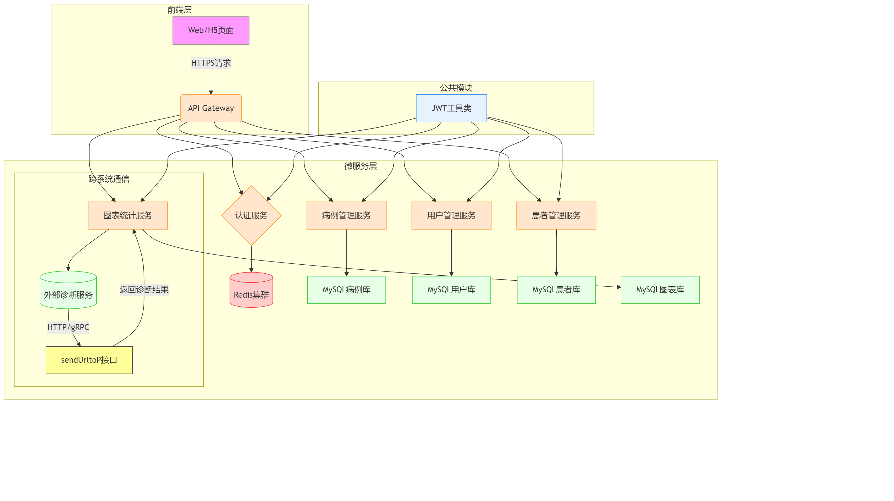
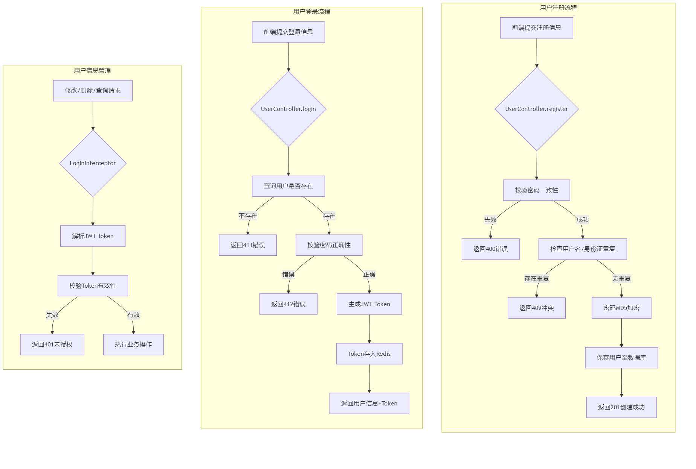
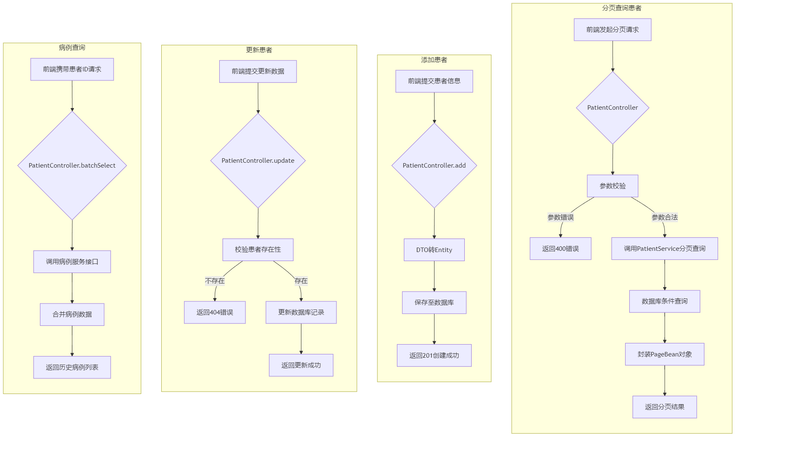
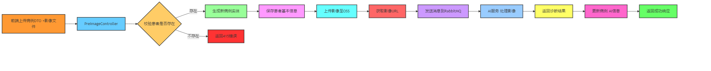
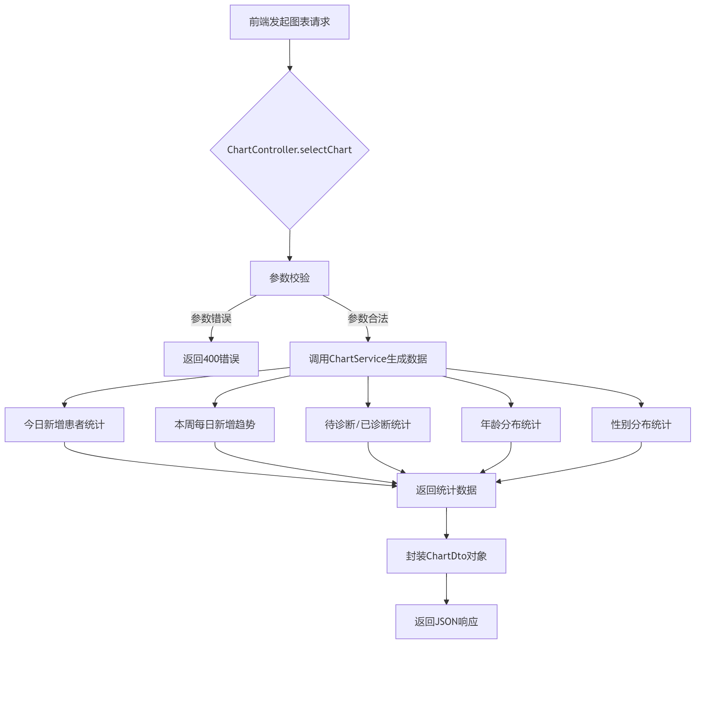

# 眼底医学管理系统

## 1.简介
- 该项目是基于SpringBoot开发的眼底医学后端业务管理系统
- 融合redis缓存、JPA、rabbitmq、OSS云存储等技术
- 采用微服务架构，实现了与ai诊断端的通信
---
## 2.功能模块
- 医生用户管理系统
- 病例管理系统
- 患者管理系统
- 图表管理系统


| 模块名称      | 主要功能                                                                 | 技术栈                                                                                     | 数据库设计                                                                                     | 安全措施                                                                                   | 关键接口                                                                                     |
|--------------|--------------------------------------------------------------------------|-------------------------------------------------------------------------------------------|---------------------------------------------------------------------------------------------|-------------------------------------------------------------------------------------------|---------------------------------------------------------------------------------------------|
| 医生用户管理系统 | 用户注册/登录、角色权限管理、医生诊断建议管理               | Spring Boot + JWT + MyBatis                                              | - `user`表（用户ID/用户名/密码/角色）<br>- `role`表（角色ID/权限列表）                       | - JWT双存储（Redis+Header）<br>- 密码MD5加密<br>                     | - `/api/user/login`（登录）<br>- `/api/user/updateRole`（角色更新）                        |
| 病例管理系统  | 病例CRUD、分页查询、AI诊断结果存储、历史病例关联查询                      | Spring Data JPA + Redis                                                      | - `case`表（病例ID/患者ID/诊断状态）<br>- `ai_result`表（AI诊断结果）<br>- `history_case`表 | - 事务控制（@Transactional）<br>- Redis分页缓存          | - `/api/case/list`（分页查询）<br>- `/api/case/updateNorDiag`（AI诊断结果更新）             |
| 患者管理系统   | 患者档案管理、患者病例关联、批量病例查询                                  | Spring Boot + MyBatis + PageHelper                                                          | - `patient`表（患者ID/姓名/年龄/性别）<br>- `patient_case`表（患者ID/病例ID）               | - JWT<br>                                           | - `/api/patient/list`（分页查询）<br>- `/api/patient/batchSelect`（批量病例关联查询）       |
|图表管理系统 | 统计图表生成（新增趋势/年龄分布/性别分布）、跨系统诊断接口通信            | ECharts                               | - `statistic`表（统计类型/数据）<br>- `cache_chart`表（图表缓存）                          | - 接口鉴权（JWT）<br>- 数据加密传输（HTTPS）<br>                  | - `/api/chart`（图表数据生成）<br>- `/api/chart/sendUrltoP`（外部诊断服务通信）             |
---
## 3.系统架构
### 技术栈概览表

| 技术分类    | 技术栈                        |
|---------|----------------------------|
| ​**后端** |                            |
| 框架      | Spring Boot                |
| 数据库     | MySQL (JPA)                |
| 缓存      | Redis                      |
| 消息队列    | RabbitMQ                   |
| 云存储     | 阿里云OSS                     |
| ​**部署** |                            |
| 容器化     | Docker + Docker Compose    |


---
## 4.详细介绍

### 1. 医生用户管理系统
- 医生用户管理系统是一个基于SpringBoot开发的后台管理系统，主要用于管理医生用户的信息。
- 该系统提供了医生用户的增删改查功能，同时也支持医生用户的登录、注册等功能。
- 该系统的主要功能包括：
  - 医生用户的增删改查功能
  - 医生用户的登录、注册等功能
  - 医生用户的信息管理功能
#### 1.流程图

#### 2.关键流程详解
1. JWT认证流程
Token生成：包含userId和userName的Claims
- 双存储机制：
      前端：响应头返回Token
      后端：Redis存储Token（有效期1天）
- 拦截器联动：
      请求头校验Token有效性
      Token失效自动清除Redis记录
- 用户信息操作
   修改/删除：需携带有效Token
   敏感字段保护：
   密码字段不返回前端
   头像URL单独接口管理
   事务控制：使用@Transactional保证数据一致性
2. 安全设计方案
- 防御CSRF攻击：通过JWT Token替代传统Session
- 密码安全策略：
      MD5加密（可扩展为加盐哈希）
      密码复杂度校验（需在前端添加校验）
- Token防护：
      Redis存储黑名单（退出登录时加入）
      定期强制刷新Token
3. 扩展性设计
- 第三方登录支持：可在UserController添加OAuth接口
- 用户画像系统：在User实体中扩展属性字段
#### 3.关键代码片段
```java
      public boolean preHandle(HttpServletRequest request, HttpServletResponse response, Object handler) {
      String token = request.getHeader("Authorization");
      if (token == null || !stringRedisTemplate.hasKey(token)) {
            return ResponseMessage.loginRedisError(); // Token无效
        }

      try {
        // 解析Token并存储到ThreadLocal
        Map<String, Object> claims = JwtUtil.parseToken(token);
        ThreadLocalUtil.set(claims);
        return true;
     } catch (Exception e) {
          return ResponseMessage.loginerror(); // Token过期或解析失败
      }}
      
```
### 2.患者管理系统
- 患者管理系统是一个基于SpringBoot开发的后台管理系统，主要用于管理患者的信息。
- 该系统提供了患者的增删改查功能，同时也支持患者的登录、注册等功能。
- 该系统的主要功能包括：
  - 患者的增删改查功能
  - 支持历史病例查询，模糊查询，分页查询
#### 1.流程图

#### 2.关键流程详解
- 与用户管理类似
### 3.病例管理系统
- 病例管理系统是一个基于SpringBoot开发的后台管理系统，主要用于管理病例的信息。
- 该系统提供了病例的增删改查功能，同时也支持病例的登录、注册等功能。
- 该系统的主要功能包括：
  - 病例的增删改查功能
  - 支持历史病例查询，模糊查询，分页查询
#### 1.流程图


#### 2.核心流程详解
1. 请求入口
- 前端通过/api/preImage/saveAndProcess1接口提交：
  - 患者ID
  - 左右眼影像文件
  - 其他病例信息
2. 服务层处理
- PreImageController:
  - 校验患者是否存在
  - 创建病例基础实体
  - 调用PreImageService处理影像
3. 影像处理
- AliOssUtil上传影像至OSS
- 生成标准化文件名（含患者ID+时间戳）
- 返回影像访问URL
4. 异步AI处理
- 通过RabbitMQ发送消息包含：
      ```java
      class ImageProcessMessage{
   String caseId;
   String leftUrl;
   String rightUrl;
   int patientAge;
   int patientGender;
   String patientName;
      }
      ```
- AI服务处理完成后返回诊断建议
5. 数据持久化
- 更新病例实体的：
  - 影像URL
  - AI诊断结果（aiCaseInfo字段）
  - 状态标记（diagStatus=1）
#### 3.关键代码片段
  1. 影像上传核心逻辑（PreImageServiceImpl）：
      ```java
        // 上传OSS并获取URL
        String urlLeft = AliOssUtil.uploadFile(filename, file.getInputStream());
        // 发送到RabbitMQ
        rabbitTemplate.convertAndSend(
        RabbitMQConfig.IMAGE_PROCESS_EXCHANGE,
        new ImageProcessMessage(caseId, urlLeft, urlRight, patientInfo)
        );
      ```
  2. RabbitMQ消息处理（ImageProcessConsumer）：
```java
      @RabbitListener(queues = RabbitMQConfig.IMAGE_PROCESS_QUEUE)
      public void process(@Payload ImageProcessMessage message) {
        try {
            ResponseData responseData = preImageService.sendUrltoP(

                    message.getPatientAge(),
                    message.getPatientGender(),
                    message.getPatientName(),
                    message.getCaseId(),
                    message.getLeftImageUrl(),
                    message.getRightImageUrl()
            );

            if (!responseData.getSuccess()) {
                // 处理失败逻辑（重试/记录日志等）
                throw new RuntimeException("AI诊断失败");
            }
            // 更新数据库状态
            ...

        } catch (Exception e) {
            ...
        }}
```
3. 与ai诊断端通信（PreImageServiceImpl）：
```java
      public ResponseData sendUrltoP(int age ,int gender ,String name, String caseId, String urlLeft, String urlRight) {
    String apiUrl =
            "http://127.0.0.1:4523/m1/5970416-5658644-default/api/process-images/";
    HttpHeaders headers = new HttpHeaders();
    headers.setContentType(MediaType.APPLICATION_JSON);
    //
    Map<String, Object> requestBody = new HashMap<>();
    requestBody.put("caseId", caseId);
    requestBody.put("name", name);
    requestBody.put("age", age);  // 直接使用int类型
    requestBody.put("gender", gender);  // 直接使用int类型
    requestBody.put("urlLeft", urlLeft);
    requestBody.put("urlRight", urlRight);
    //发送请求体
    ResponseEntity<String> response = restTemplate.postForEntity(
            apiUrl,
            requestBody,
            String.class
    );
//省略部分代码
}

```
#### 5. 架构特点
- 解耦设计：通过RabbitMQ实现影像处理与主流程异步解耦
- 扩展性：新增AI算法只需修改消息消费者
- 可靠性：OSS存储保障影像数据持久化
- 安全性：患者ID通过路径参数传递避免敏感信息泄露
### 4.图表管理系统
- 图表管理系统是一个基于SpringBoot开发的后台管理系统，主要用于管理图表的信息。
- 该系统的主要功能包括： 支持图表查询
#### 1. 流程图



#### 2. 核心流程详解
- 为全面呈现医疗数据的特征，从多个统计维度展开分析，各维度均有对应的实现方法与数据来源。


   | 统计维度          | 实现方法                      | 数据来源                |
   |-------------------|------------------------------|---------------------|
   | 今日新增患者       | countTodayPatients()         | 患者表 create_date 字段  |
   | 本周每日趋势       | getWeeklyPatients()          | 患者表 create_date 字段  |
   | 待诊断 / 已诊断    | countByStatusToday()         | 病例表 status 字段       |
   | 年龄分布           | getAgeDistributionByDisease()| 患者表 age 字段          |
   | 性别分布           | getGenderDistributionByDisease() | 患者表 gender 字段<br/>  |


#### 3. 关键代码片段
1. 年龄分布统计逻辑（ChartServiceImpl）：
```java
public Map<String, Integer> getAgeDistributionByDisease(String diseaseName) {
    List<String> patientIds = caseRepository.findPatientIdsByDiseaseNameContaining(diseaseName);
    
    return Map.of(
        "0-17", countPatientsInAgeGroup(patientIds, 0, 17),
        "18-34", countPatientsInAgeGroup(patientIds, 18, 34),
        "35-49", countPatientsInAgeGroup(patientIds, 35, 49),
        "50-64", countPatientsInAgeGroup(patientIds, 50, 64),
        "65+", countPatientsInAgeGroup(patientIds, 65, 200)
    );
}
```
2. 性别分布统计逻辑（ChartServiceImpl）：
```java
public Map<String, Integer> getGenderDistributionByDisease(String diseaseName) {
    List<String> patientIds = caseRepository.findPatientIdsByDiseaseNameContaining(diseaseName);
}
```
3. 待诊断 / 已诊断统计逻辑（ChartServiceImpl）：
```java
public Map<String, Integer> countByStatusToday() {
    LocalDate today = LocalDate.now();
    LocalDateTime startOfToday = today.atStartOfDay();
    LocalDateTime endOfToday = today.atTime(23, 59, 59);
}
```
---
## 5.代码可用性

本系统的所有代码均开源，包括模型训练、数据处理、算法实现等。您可以通过以下链接访问完整代码：

- https://github.com/wzzzszh/ophai_diags_backend